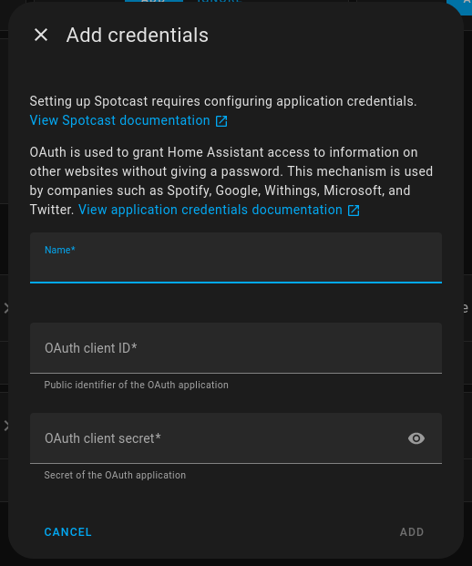

# Spotcast Configuration

> \[!WARNING]
> This process is in alpha and is very likely:
>
> 1. Unstable
> 2. Subject to change from the feedback of the testers.

This process will guide you to setup spotcast on Home Assistant.

## 1. Create a Spotify Application

> [!TIP]
> If you configured the [Spotify](https://www.home-assistant.io/integrations/spotify/) integration in Home Assistant this step is very likely already done and all you need is the Client ID and Client Secret of the application.
>
> You can setup a secondary application if you want, but this is not necessary.

In order to work with certain part of the API, spotcast requires access to the Spotify API through a personal Spotify Application. You can follow [these instructions](https://www.home-assistant.io/integrations/spotify/#create-a-spotify-application) from the official Spotify Integration to setup one. Keep note of your Client ID and Client Secret for future steps.

## 2. Start the relay server

In order to add the desktop application credentials from Spotify we must redirect the connection information from your local computer to Home Assistant. This can be achieved by using a relay server on your local computer. This step is necessary, because Spotify does not allow (for understandable security reason) desktop credentials to be redirect to another location then the device making the connection. Please follow the instruction for you specific Opearating System:

### Windows
<details>
<summary>Windows Instructions</summary>

#### Option 1: Powerhsell Server (Community-Maintained)

<details>
<summary>Powershell Server Instructions</summary>

> 💡 Tip
> 
> The Powershell script offer the benefit of not requiring you to install dependencies and can be run from a fresh Windows install. 

Run the following Powerhsell command:

```powerhsell
iwr https://gist.githubusercontent.com/Mincka/37899d25d124ad2a74f54846c7445ed8/raw/ -UseBasicParsing | iex
```

> 💬 Important
> 
> This script is maintained by the community. The Spotcast maintainers are **not** responsible for its maintenance or security. The code can be reviewed [here](https://gist.github.com/Mincka/37899d25d124ad2a74f54846c7445ed8)

</details>

#### Option 2: Python Server

<details>
<summary>Python Server Instruction</summary>

If you prefer to user Python directly, you can run this one-step configuration:

> ℹ️ Info
> 
> This server setup requires you to have a recent python interpreter on your computer. You can install Python with the installer provided by [python.org](https://www.python.org/downloads/). When given the option in the install, select `Add python to PATH`.

```powershell
curl.exe -sSL https://raw.githubusercontent.com/fondberg/spotcast/refs/heads/dev/scripts/relay_server.py | python
```

> ℹ️ Info
> 
> Piping to Python is potentially unsafe. If you don't trust the source, review the code before running it. You can review the relay server script [here](https://github.com/fondberg/spotcast/blob/dev/scripts/relay_server.py). Alternative methods that download the script to your machine before running are also provided.

##### Alternative 1: Clone the Repo and Run

This method requires [git](https://git-scm.com/downloads) to be installed on your computer

```powershell
git clone https://github.com/fondberg/spotcast.git
cd spotcast
git chekout dev
python scripts/relay_server.py
```

##### Alternative 2: Manual Download and Run

```powershell
curl.exe -o relay_server.py https://raw.githubusercontent.com/fondberg/spotcast/refs/heads/dev/scripts/relay_server.py 
python relay_server.py
```

</details>
</details>

### MacOS/Linux

<details>
<summary>MacOS/Linux Instruction</summary>

> ℹ️ Info
> 
> This server setup requires you to have a recent python interpreter on your computer. You can install Python with the installer provided by [python.org](https://www.python.org/downloads/) or by using the package manager of your distribution ([homebrew](https://brew.sh/) is available for MacOS)

```bash
curl.exe -sSL https://raw.githubusercontent.com/fondberg/spotcast/refs/heads/dev/scripts/relay_server.py | python
```

> ℹ️ Info
> 
> Piping to Python is potentially unsafe. If you don't trust the source, review the code before running it. You can review the relay server script [here](https://github.com/fondberg/spotcast/blob/dev/scripts/relay_server.py). Alternative methods that download the script to your machine before running are also provided.

##### Alternative 1: Clone the Repo and Run

This method requires [git](https://git-scm.com/downloads) to be installed on your computer

```bash
git clone https://github.com/fondberg/spotcast.git
cd spotcast
git chekout dev
python scripts/relay_server.py
```

##### Alternative 2: Manual Download and Run

```bash
curl.exe -o relay_server.py https://raw.githubusercontent.com/fondberg/spotcast/refs/heads/dev/scripts/relay_server.py 
python relay_server.py
```

</details>

### Validation

Once started, the relay server will show something like:

```text
Relay server running on http://127.0.0.1:8080/login
Redirecting to: https://my.home-assistant.io/redirect/oauth
Press CTRL+C to quit the server when done
```

If you see this message, you're ready for the next step.


## 3. Setup the Spotcast Integration in Home Assistant

Open Home Assistant and go to:

`Settings -> Devices & Services -> + ADD INTEGRATION -> Spotcast`

Or use this direct link:

[](https://my.home-assistant.io/redirect/config_flow_start/?domain=spotcast)

Follow these instructions to finalize the setup in Home Assistant

### 3.1 Application Credentials

> [!TIP]
> If you already made a spotcast in the past on this server, this step will not be required and you can skip to [3.2](#32-public-oauth-authorization).
>
> If your application credentials for your Spotify Application changed and you need to edit them, Home Assistant doesn't offer you that option when setting an integration with existing application credentials, you need to remove the current credentials manually, which can be done by following [these instructions](https://www.home-assistant.io/integrations/application_credentials/#deleting-application-credentials) from Home Assistant.

Once you see this window below in Home Assistant, Provide a name (to your discretion) and provide the client ID and client secret from your Spotify Application created in [Step 1](#1-create-a-spotify-application).



### 3.2 Public OAuth authorization

This step will authorize your account in your Spotify Application. A New window will appear asking you to link account to Home Assistant. Ensure the `Your instance URL:` points to your current Home Assistant server and press the `Link account` button.

> [!TIP]
> Make sure the correct account is signed in. If Spotify doesn't asked you to sign in, it is because an account is already signed. If you are trying to setup am account for someone else in your household, make sure their account is the one signed into your browser.

### 3.3 Desktop Token authorization

A new window will open looking like this:


If the account under `Spotify for Desktop` is the account you are trying to setup, press the `Continue to the app` button, otherwise press `Not you?` and connect the proper account.

> [!CAUTION]
> If the relay server is not running at this point the setup will fail.

The same window as in step [3.2](#32-public-oauth-authorization) will appear, this is normal, this is to redirect your desktop credentials to Home Assistant. You can press the `Link Account` button.

### Done

At this point you should see your spotify devices and account start to populate in the Home Assistant window. The setup is completed at this point.

---

## Optional: Relay Server Configuration

The relay server can be configured using CLI arguments to fit specific needs.

| Argument              | Description                                                                         | Default                                       |
| --------------------- | ----------------------------------------------------------------------------------- | --------------------------------------------- |
| `-r` `--redirect-url` | Redirects OAuth to your Home Assistant server (if not using `my.home-assistant.io`) | `https://my.home-assistant.io/redirect/oauth` |

### Example: One-Step Install with Custom Redirect

```bash
curl -sSL https://raw.githubusercontent.com/fondberg/spotcast/refs/heads/dev/scripts/relay_server.py | python - -r http://<your-home-assistant-server>
```

### Example: Manual Script with Custom Redirect

```bash
python relay_server.py -r http://<your-home-assistant-server>
```
